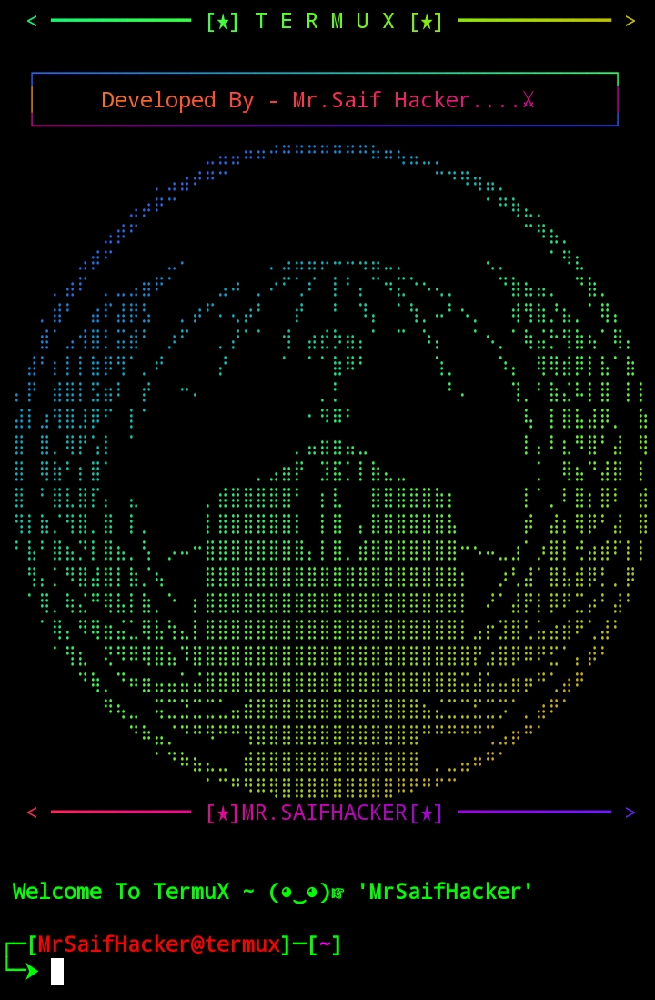
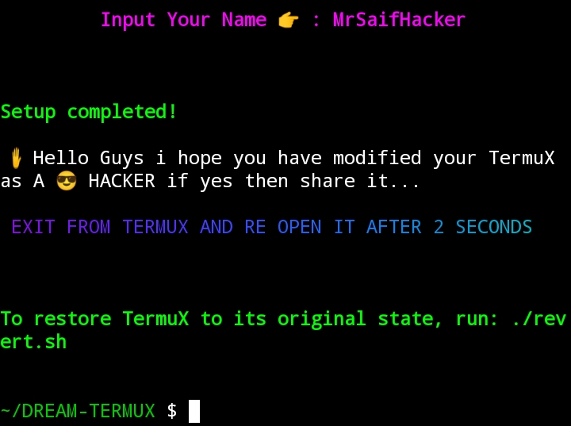

# DREAM-TERMUX

**DREAM-TERMUX** DREAM-TERMUX: Transform your TermuX into a Advance hacking-themed terminal with style and customization plugin

---

## Features

- **Hacking-Themed UI**: A visually appealing hacking-inspired interface with banners and colors.
- **Custom Welcome Script**: Displays a personalized welcome message.
- **Background Music**: Plays typing sound effects during terminal usage.
- **Customizable Prompt**: Personalized terminal prompt (`PS1`).
- **Easy Installation and Setup**: Streamlined installation process with package installation and configuration.
- **Reverting Option**: Easily restore TermuX to its original settings.

---

## Installation

1. Clone the repository:
   ```bash
   git clone https://github.com/Mrsaifhacker65/DREAM-TERMUX.git
   cd DREAM-TERMUX
   ```

2. Run the setup script:
   ```bash
   bash setup.sh
   ```

3. Follow the on-screen instructions and provide your name when prompted.

4. Exit TermuX and reopen it after 2 seconds to enjoy the new hacking-themed interface.

---

## Reverting to Default TermuX Settings

If you wish to revert TermuX to its original state, follow these steps:

1. Navigate to the tool's directory:
   ```bash
   cd DREAM-TERMUX
   ```

2. Run the revert script:
   ```bash
   bash revert.sh
   ```

3. Exit TermuX and reopen it to see the default TermuX settings restored.

---

## Dependencies

DREAM-TERMUX installs the following packages:
- **mpv**: For sound playback.
- **figlet**: For ASCII art banners.
- **python2**: For custom scripts.
- **ruby**: For text coloring with `lolcat`.
- **lolcat**: For rainbow-colored text output.

All dependencies are automatically installed during the setup process.

---

## Customization

### 1. Welcome Message
The welcome message is set based on the name you provide during installation. You can manually edit the `wlc.py` file in:
```bash
/data/data/com.termux/files/usr/etc/
```

### 2. Typing Sound
The typing sound effect (`typing.mp3`) is stored on your device's storage in `/sdcard`. Replace it with another sound file if needed.

## Screenshots

### Hacking-Themed Interface


### Installation Process


---

## Developed By

**Mr.Saif Hacker**  
GitHub: [Mrsaifhacker65](https://github.com/Mrsaifhacker65)

---

## License

This tool is released under the MIT License. You are free to use, modify, and distribute it as per the terms of the license.

---

## Disclaimer

This tool is for educational purposes only. The developer is not responsible for any misuse or damage caused by this tool. Use it responsibly.
